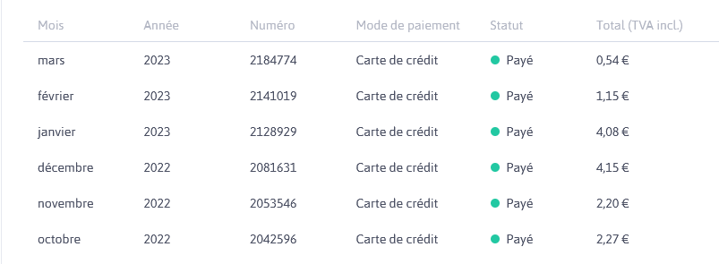
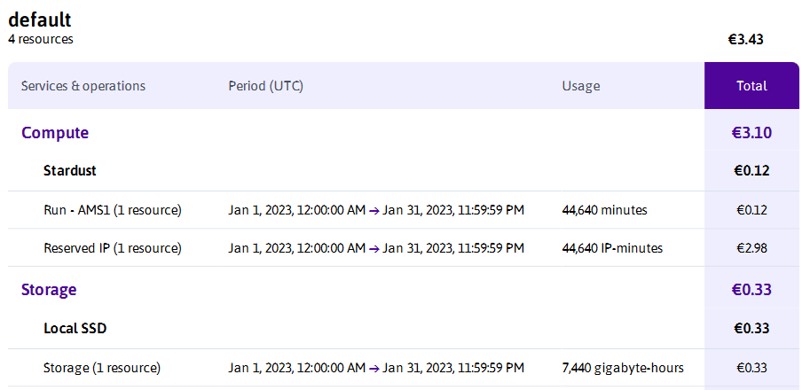

## Mon utilisation du cloud

La tendance actuelle semble inciter à tout transformer en conteneurs (voire fonctions) pour avoir une application super flexible, scalable et déployée automatiquement. Je dois avouer que malgré mon intérêt pour ces technologies, mon site web est hébergé de manière très classique, sur une VM. Il y a deux raisons principales à cela :
- Héberger un site web quasiment statique, ça ne demande que très peu de puissance de calcul. Et, vu la charge qu'il supporte (2 visites par jour +/- quelques crawlers perdus sur la toile) je n'ai pas besoin que mon déploiement soit mis à l'échelle automatiquement.
- Je veux que le coût mensuel de mon site web soit constant (ou au moins prévisible). Or, n'ayant pas (encore) de certification GCP, AWS ou Azure, je n'aurais pas la prétention de réussir à prévoir ma facture cloud sur ces plateformes. 

J'ai donc cherché quel fournisseur cloud proposait la VM la moins chère possible, facturée au mois.

## Stardust de Scaleway

Il me semble que c'est en [novembre 2020](https://www.nextinpact.com/article/67921/scaleway-lance-stardust-1-vcpu-1-go-ram-et-10-go-stockage-pour-18-euro-par-mois) que Scaleway, ex-Online.net, lance l'offre de VM "Startdust". Pour un peu moins de 2€ par mois, j'avais une VM avec 1 vCPU, 1Go de RAM et 10Go de stockage. C'était parfait pour mon utilisation. Et visiblement, je n'étais pas le seul à penser ça, car cette offre est en rupture de stock depuis près de 2 ans. Scaleway n'ont d'ailleurs probablement aucun intérêt à la remettre en vente, si ce n'est pour refaire un coup de pub. "La VM la moins chère du marché", c'est très vendeur, mais peu rentable.

## 2€ par mois, c'est trop cher ?

Non, 2€ par mois, ce n'est pas cher. Mais en décembre 2022, avec les hausses des prix de l'énergie, Scaleway ont annoncé une hausse de 15% en moyenne sur tous leurs services. Et dans mon cas, c'était carrément une hausse de 100% : ma VM a commencé à me couter 4€ par mois. Cela reste très raisonnable, mais c'était l'occasion pour moi de me pencher sur ma facture.

Même pour les instances Stardust, Scaleway décomposent la tarification en 3 parties : la puissance de calcul (compute), le stockage (storage) et le réseau.

Dans les 4€ que je payais pour mon instance, seuls 12 centimes concernaient le compute de mon instance, 33 centimes pour les 20Go de SSD qui y sont attachés, et près de 3€ pour l'adresse IPv4 publique de ma VM !

## La solution

Scaleway me laisse la possibilité de supprimer mon adresse IPv4 publique. Mais vous allez me dire que si je supprime mon adresse IPv4 publique, je ne pourrais plus accéder à ma VM ! Et bien non ! C'est possible, grâce à une technologie révolutionnaire : l'IPv6 ! Du moment que j'ai une connexion avec une IPv6 (en France, c'est désormais très courant), je peux me SSH à ma VM. Et pour l'accès web, c'est de l'IPv6 only ? Et non, j'ai trouvé une astuce pour conserver l'accès en IPv4 aussi.

En effet, j'utilise Cloudflare comme Reverse Proxy pour mon site (ce qui me facilite aussi la vie pour les certificats HTTPS). Lorsque vous faites une requête DNS pour obtenir l'IP de `manvan.fr`, c'est l'IPv4 et l'IPv6 du reverse proxy de Cloudflare qui sont renvoyées. Cloudflare va ensuite transmettre toutes les requêtes en IPv6 à ma VM.

Je ne paie donc plus que 50 centimes par mois pour mon instance Stardust, et je cherche désormais le moyen de me passer de SSD. Si vous connaissez le moyen de démarrer un OS sur une VM Scaleway sans disque attaché, je suis preneur.

## Les inconvénients

Cloudflare par sa multitude de services efficaces, souvent gratuits et relativement simples d'utilisation, a acquis une part de marché très importante parmi les CDN (~80%). D'un point de vue technique, je trouve leur offre très intéressante, mais je suis gêné par leur position domainte. Qu'une société privée détienne autant de pouvoir sur Internet n'est pas une bonne chose selon moi. Lorsque vous pouvez vous passer de leur service, privilégiez [une alternative européenne](https://european-alternatives.eu/alternative-to/cloudflare). 

Je publierai un article sur la solution que j'ai trouvée pour me passer de CloudFlare, dès que je l'aurais mise en place et éprouvée.

> Plus de détails sur le [mouvement deCloudflare](https://0xacab.org/my-privacy-dns/deCloudflare/-/blob/master/readme/fr.md)