Élève à Télécom Paris, vous devez travailler votre projet PACT mais n'êtes pas encore très à l'aise avec Git ?

J'ai plusieurs solutions pour vous :

* Suivre les tutos de Rezel [disponibles ici](https://tutos.rezel.net/git/) pour vraiment apprendre à utiliser GitKraken
* Tricher en utilisant un logiciel avec un jolie interface graphique

Ce tuto vous explique comment tricher 😉

## 1. Une licence PRO gratuite

GitKraken possède une version gratuite plutôt sympa, mais elle manque de fonctionnalités telles que la connexion à des dépôts Git privés (le GitLab de Télécom). Mais heureusement, étant étudiants, de nombreux éditeurs de logiciels n'hésitent pas à nous fournir des __licences gratuites__ en espérant que nous devenions de fidèles clients et continuions à utiliser leurs logiciels après nos études.

La version Pro de GitKraken est distribuée via le *GitHub Student Developper Pack*. Pour souscrire à ce pack, rendez vous sur [ce lien](https://education.github.com/benefits).

Le but va être de fournir votre __adresse e-mail étudiante__ à GitHub. Pour cela, vous pouvez soit utiliser un compte GitHub existant, soit en créer un nouveau.

* Si vous créez un compte, utilisez directement votre adresse e-mail étudiante et validez toutes les étapes nécessaire à la création du compte.

* Si vous avez déjà un compte avec une adresse e-mail "non-étudiante", vous pouvez rajouter cette dernière à votre compte dans les [paramètres de votre compte GitHub](https://github.com/settings/emails).

Une fois votre adresse mail étudiante ajoutée, la page du [*GitHub Student Developper Pack*](https://education.github.com/benefits) devrait vous afficher la liste des services inclus dans le pack. Comme vous le voyez, vous avez accès à pleins de trucs pour vraiment pas cher, dont la version PRO de GitKraken.

## 2. GitKraken

Téléchargez le logiciel [ici](https://www.gitkraken.com/download) et installez-le.

Le logiciel se lance avec une jolie interface, bien plus conviviale qu'un terminal.
__Première chose à faire :__ connectez vous avec votre compte GitHub que vous avez créé dans la partie 1.

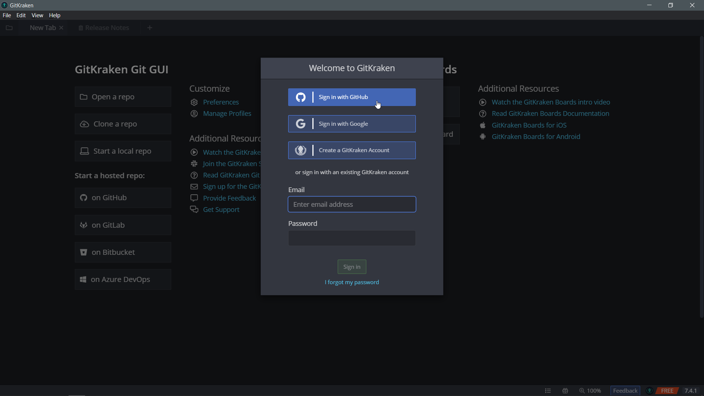

__Deuxième étape :__ remplissez votre profil, avec l'adresse e-mail et le nom qui sera affiché comme auteur des commit que vous effectuerez :

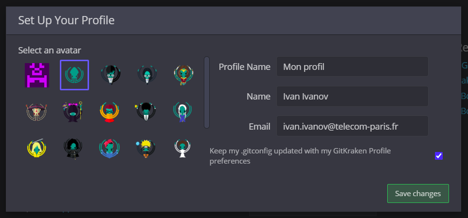

Voilà, votre compte est (presque) entièrement paramétré, vous devriez ainsi voir le petit ruban "PRO" en bas à droite de la fenêtre :

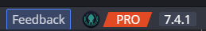

### 2.1 Les dépots

Ensuite, il va falloir ajouter votre dépôt Git (repo = dépôt en anglais). Pour cela vous avez 3 possibilités :

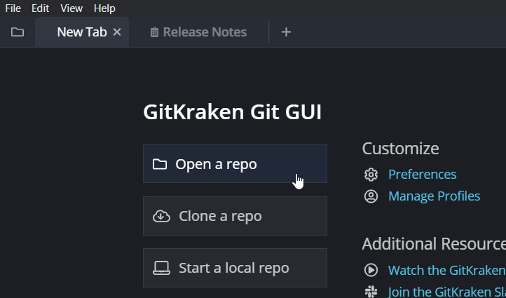

* __Open a repo__ permet d'ouvrir un dépôt qui est déjà présent en local sur votre ordinateur.
* __Clone a  repo__ permet de télécharger un dépôt depuis un serveur Git.
* __Start a local repo__ permet de créer un dépôt sur votre ordinateur, que vous pourrez ensuite envoyer sur un serveur Git.

Dans tous les cas, vous devez indiquer à GitKraken le chemin du dossier où est/sera stocké votre dépôt.
Dans le cas *clone*, vous devez aussi donner l'URL de votre dépôt sur Internet.

__Problème :__ Votre dépôt est privé, c'est-à-dire qu'il faut être authentifié au serveur (le GitLab de Télécom dans notre cas) pour pouvoir *clone* ou, s'il est déjà sur votre ordinateur, pour y *push* vos modifications. Vous vous rappelez peut-être qu'il y a d'habitude une histoire de clés SSH ? Ne vous inquiétez pas, nous allons tout arranger simplement, sans taper une seule commande 😃.

__Nous avons deux solutions :__

* [l'intégration directe](#211-intégration-gitlab) des fonctionnalités de votre plateforme Git en ligne (par exemple, un GitLab hébergé par Télécom Paris) à GitKraken,
* [l'utilisation de clés SSH](#212-connexion-via-clés-ssh) Plus classique, elle est utile lorsque GitKraken ne permet pas l'intégration avec le serveur Git que vous utilisez.

#### 2.1.1 Intégration GitLab

Rendez-vous dans les paramètres de GitKraken `File -> Preferences`, puis dans l'onglet "Integrations".

Sélectionnez GitLab Self-Managed et entrez l'adresse : `gitlab.telecom-paris.fr` dans le champ *Host Domain*.

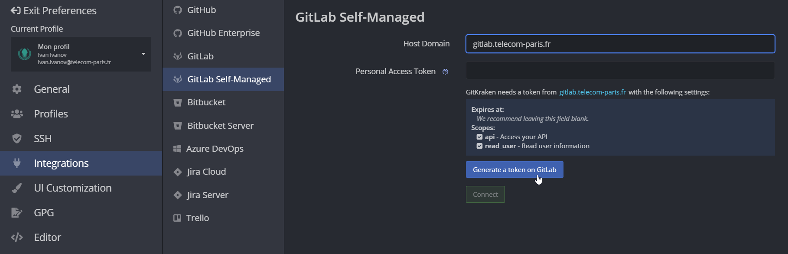

En cliquant sur "Generate a token on GitLab" vous serez redirigé vers la page web suivante :

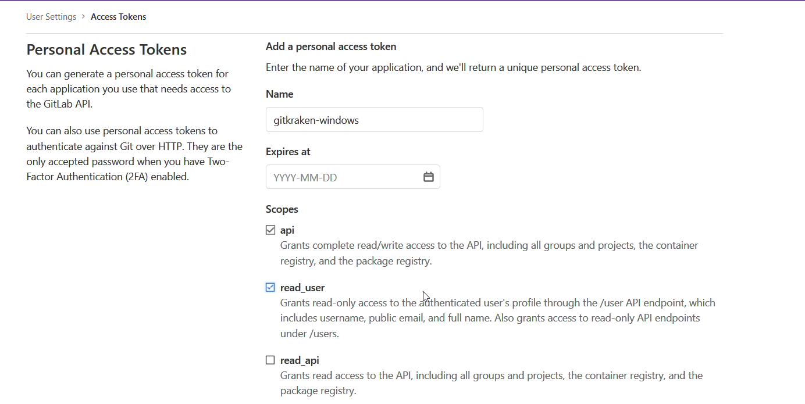

Il suffit de donner un nom à la clé, laisser vide le champ __Expires at__ et cocher les cases __api__ et __read_user__.

Une fois la clé générée, collez-la dans GitKraken avant de changer de page, __GitLab ne vous la montre qu'une seule fois !__

Vous êtes désormais connectés à votre compte GitLab sur GitKraken, vous pouvez *cloner* des dépots en utilisant l'onglet [Clone -> GitLab Self-Managed] où vous pouvez trouver un dépot juste avec son nom.

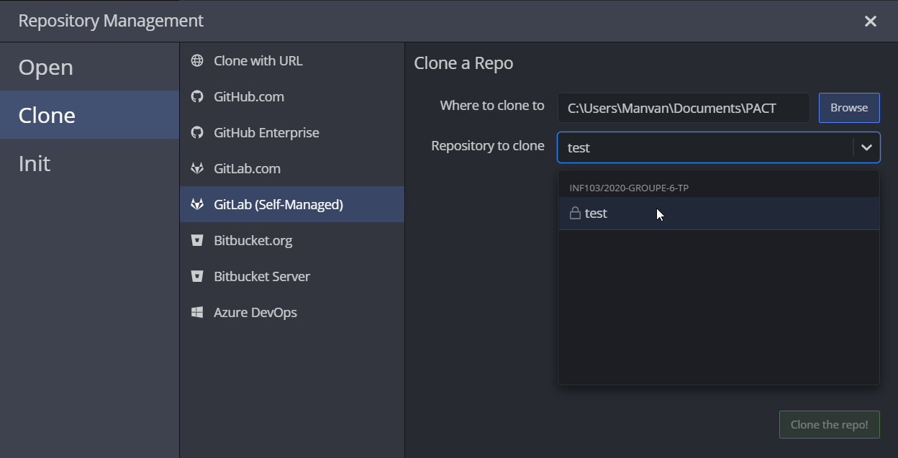

Vous pouvez passer au point [2.2](#22-une-interface-graphique-pour-git)

#### 2.1.2 Connexion via clés SSH

Rendez-vous dans les paramètres de GitKraken [File -> Preferences], puis dans l'__onglet SSH__.

*(Si vous avez déjà généré une clé SSH sur votre machine et que celle-ci fonctionnait, vous pouvez simplement cocher la case "Use local SSH agent". Mais ce n'est pas une solution très fiable)*.

Cliquez sur le bouton __Generate__ puis copiez la clé publique générée en cliquant sur l'icône juste à côté.
Rendez-vous sur votre plateforme en-ligne Git, dans les paramètres de clé SSH ([ici pour le GitLab de Télécom](https://gitlab.telecom-paris.fr)).
Vous devriez avoir une interface de ce type :

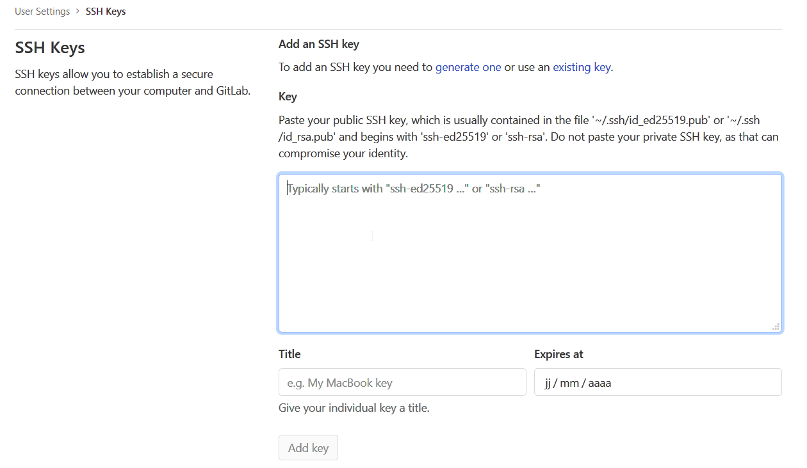

Il suffit de coller la clé, lui donner un nom évocateur, laisser vide le champ __Expires at__ et cliquer sur __Add Key__.

Vous êtes désormais authentifié à votre compte GitLab sur GitKraken, vous pouvez *clone* des dépots en fournissant l'url de votre dépot dans l'option __Clone with URL__ de GitKraken.

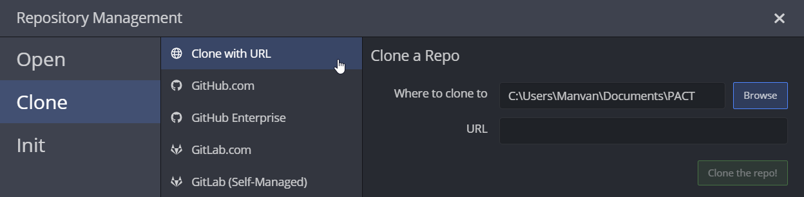

### 2.2 Une interface graphique pour Git

Une fois que vous avez cloné votre dépôt, GitKraken vous propose de l'ouvrir, suivez son conseil :

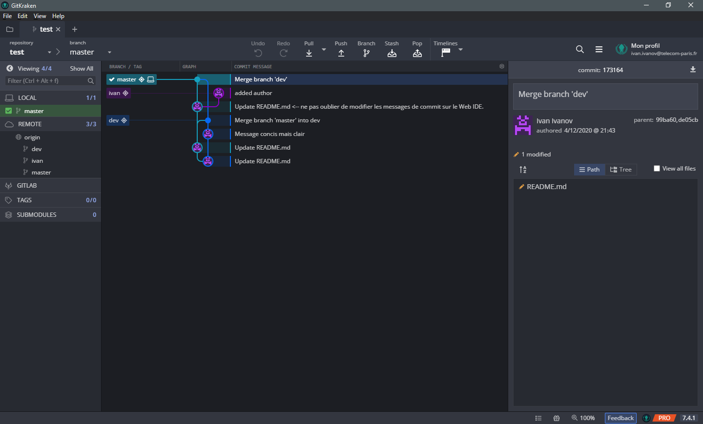

Vous arrivez maintenant dans l'interface de gestion de dépôt, soit l'interface que vous allez le plus utiliser.
__Cette dernière est divisée en 3 parties :__

* Au centre, vous avez l'__arborescence de tous les commits__ effectués sur le dépot
* À droite, vous avez les __informations à propos du commit__ que vous avez sélectionné au centre (en cliquant dessus). Notamment, la description du commit, ainsi que les modifications effectuées.
* À gauche, vous avez la __liste des branches du dépot__, séparées en deux catégories : les branches locales et les branches distantes ("Remote").

#### 2.2.1 Les branches

Vous devez toujours vous assurer d'avoir sélectionné la bonne branche avant d'effectuer des modifications sur votre projet.
Deux commandes permettent cela :

* `git fetch origin <branche>` permet de télécharger une branche distante
* `git checkout <branche>` permet de sélectionner une branche locale.

Sur GitKraken, tout cela s'effectue avec un __double clic sur la branche que vous voulez sélectionner__.
Par exemple, ayant tout juste cloné mon dépôt, je n'ai que la branche "master" en local.

| 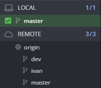 | 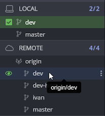 |
|-------|-------|
| avant | après |

Je veux sélectionner la branche dév, je double clique dessus dans la liste des branches distantes, elle est automatique téléchargée (`git fetch`) et sélectionnée (`git checkout`).
Les fichiers du projet sont automatiquement mis à jour avec la version sur la branche "dév".

#### 2.2.2 Les commits

Maintenant, je peux travailler sur les fichiers de mon projet, les modifications seront automatiquement détectées par GitKraken et signalées tout en haut de l'arborescence par une ligne __// WIP__ :

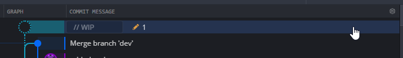

En cliquant sur cette ligne, la liste des fichiers modifiés s'affiche dans la colonne de droite.

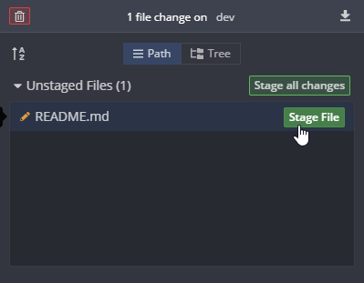

Je peux alors __Stage__ chaque fichier (équivalent de `git add`) pour qu'il soit pris en compte dans le prochain commit. Le bouton Stage all changes permet d'ajouter tous les fichiers modifiés.

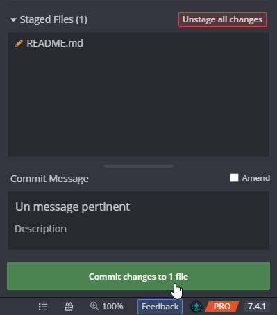

Il suffit enfin d'écrire un message de commit pertinent et de cliquer sur le gros bouton vert (équivalent de `git commit`).

Le commit s'affiche alors dans l'arborescence au milieu.

#### 2.2.3 Envoi des modifications au serveur

Après avoir effectué un commit, il ne manque plus qu'à l'envoyer sur le serveur Git.

L'équivalent de la commande `git push` est ici un simple bouton, tout comme `git pull` d'ailleurs.

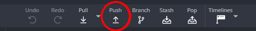

Il est recommandé de toujours *pull* avant, effectuer ses modifications, puis *push*.

GitKraken va *push* vos modifications sur la branche distante du même nom que votre branche locale sélectionnée (voir [la section 2.2.1](#221-les-branches)).

Il arrive parfois qu'il ait un doute, il vous demande alors à quelle branche distante votre branche locale est liée.

Si le nom de la branche pré-rempli est correct, vous pouvez simplement cliquer sur __Submit__.

#### 2.3 Fonction avancée : fusion de branches

Fusionner des branches est effectué par l'outil `git merge`, et permet de __fusionner les modifications de plusieurs branches en une seule__. GitKraken va nous faciliter grandement la tâche avec une interface assez pratique.

Pour initier la fusion, __glissez-déposez__ la branche (locale) dont vous voulez récupérer les modifications au dessus de la branche (locale) qui contiendra le résultat du *merge*.

* Si vous avez de la chance, c'est-à-dire que vos branches ne contiennent pas de modifications sur les mêmes fichiers, le merge s'effectue automatiquement, sans complications. Vous n'avez qu'à *push* pour le finaliser.
* Sinon, GitKraken va vous afficher un vilain message d'erreur "Merge Failed". Mais ne vous inquiétez pas, cela se résoud facilement dans la majorité des cas.

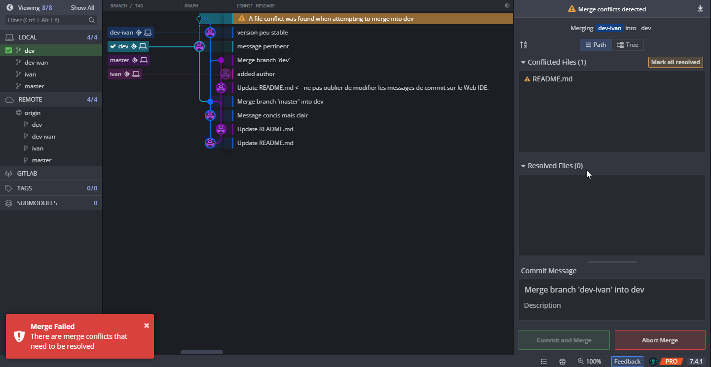

Cliquez sur un des fichiers qui rentrent en conflit, signalés par un ⚠️. L'interface de résolution des conflits s'ouvre :

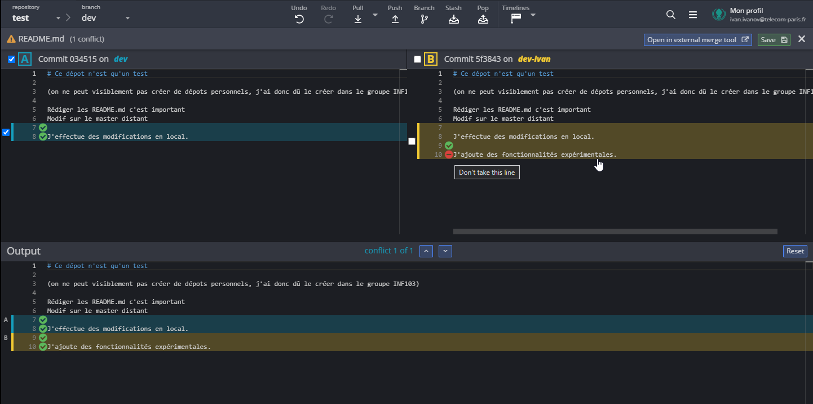

L'interface vous permet de sélectionner les lignes des fichiers A et B issus des branches que vous fusionnez (les deux blocs du haut), en vous affichant le fichier sortie résultant en bas.

Vous pouvez sélectionner les lignes par bloc en cochant la case à gauche, ou une par une avec les symboles ✅ ⛔ à gauche de chaque ligne. Une fois que le résultat correspond au résultat du merge que vous espériez, vous pouvez sauvegarder (bouton __Save__ en haut à droite).

Cette opération est à effectuer pour tous les fichiers en conflit, vous pouvez ensuite cliquer sur __Commit and merge__ et *push* vos modifications sur le serveur distant.
